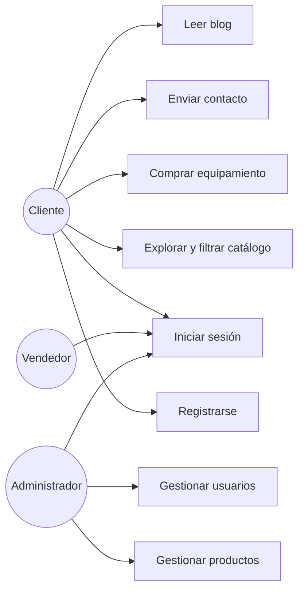

# Tienda Online "Voy y Vuelvo" — Equipamiento de Trekking

> Proyecto frontend (HTML, CSS, JavaScript) — Evaluación Parcial 1 (30%), DSY1104, Duoc UC.
> Trabajo en equipo (3 integrantes).

## Índice

1. [Descripción del proyecto](#1-descripción-del-proyecto)
2. [Objetivos y alcance de la Entrega 1](#2-objetivos-y-alcance-de-la-entrega-1)
3. [Tecnologías utilizadas](#3-tecnologías-utilizadas)
4. [Especificación de requisitos (resumen ERS)](#4-especificación-de-requisitos-resumen-ers)
5. [Planilla de requerimientos](#5-planilla-de-requerimientos)
6. [Requisitos funcionales y no funcionales](#6-requisitos-funcionales-y-no-funcionales)
7. [Casos de uso](#7-casos-de-uso)
8. [Historias de usuario](#8-historias-de-usuario)
9. [Mapa de navegación](#9-mapa-de-navegación)
10. [Roles y permisos](#10-roles-y-permisos)
11. [Reglas de validación de formularios](#11-reglas-de-validación-de-formularios)
12. [Guía de estilo](#12-guía-de-estilo)
13. [Estructura de carpetas del proyecto](#13-estructura-de-carpetas-del-proyecto)
14. [Convención de Git y commits](#14-convención-de-git-y-commits)
15. [Reparto de tareas del equipo](#15-reparto-de-tareas-del-equipo)
16. [Cómo ejecutar el proyecto](#16-cómo-ejecutar-el-proyecto)

---

## 1. Descripción del proyecto

**Voy y Vuelvo** es una tienda online de **equipamiento para rutas de trekking** (mochilas, carpas, bastones, calzado técnico, etc.). Cada producto está categorizado según el **nivel de dificultad de ruta** para el que se recomienda (Fácil, Media, Alta), de modo que un cliente que planea una ruta exigente pueda encontrar rápidamente el equipo adecuado. El sitio incluye además un blog con artículos y datos curiosos sobre rutas de trekking, y un panel administrativo para gestionar el catálogo y los usuarios del sistema.

El proyecto consta de **dos partes**, tal como exige el Anexo 1 de la evaluación:

- **Tienda** (pública): la cara visible del sitio, donde el cliente navega, se registra, compra y se contacta.
- **Administrador**: panel de gestión protegido por autenticación, donde se mantiene el catálogo de productos y los usuarios del sistema.

## 2. Objetivos y alcance de la Entrega 1

Según el Anexo 1 (Instrucciones para el desarrollo de la Evaluación 1), el proyecto debe:

- Usar HTML semántico (secciones, encabezados, párrafos, listas).
- Implementar navegación completa: hipervínculos, imágenes, botones, menús/barras laterales y formularios.
- Usar una hoja de estilos CSS externa, propia, consistente y responsiva en todas las páginas.
- Validar formularios con JavaScript en tiempo real, con mensajes de error y sugerencias dinámicas.
- Usar un repositorio remoto en GitHub, con commits claros y tareas repartidas equitativamente entre el equipo.

**Entregables de la Entrega 1:**

- Enlace GitHub público del proyecto frontend.
- Proyecto frontend comprimido.
- Documento ERS (versión 1, parcial — este README cumple ese rol de documentación técnica del proyecto).

## 3. Tecnologías utilizadas

| Categoría | Tecnología | Uso en el proyecto |
|---|---|---|
| Marcado | HTML5 | Estructura semántica de todas las páginas |
| Estilos | CSS3 (Flexbox, Grid, Media Queries) | Hoja de estilos externa, diseño responsivo |
| Lógica / interactividad | JavaScript (ES6+, vanilla) | Validaciones de formularios en tiempo real, carrito de compras, filtrado de productos |
| Almacenamiento en cliente | Web Storage API (`localStorage`) | Persistencia del carrito de compras entre sesiones del navegador |
| Tipografía | Google Fonts (Poppins, Open Sans) | Tipografía externa cargada vía `<link>` |
| Control de versiones | Git + GitHub | Repositorio remoto colaborativo del equipo |
| Entorno de desarrollo | Visual Studio Code + extensión Live Server | Edición y recarga en caliente durante el desarrollo |

No se utiliza ningún framework de CSS o JS (Bootstrap, React, jQuery, etc.) ni backend en esta entrega: el enunciado exige explícitamente una hoja de estilos **propia** y validaciones hechas **con JavaScript puro**, por lo que se prioriza código propio por sobre librerías de terceros.

## 4. Especificación de requisitos (resumen ERS)

### 4.1 Propósito

Este documento especifica los requisitos funcionales y no funcionales de la tienda online "Voy y Vuelvo", como base para su desarrollo en HTML, CSS y JavaScript durante la Evaluación 1, y como punto de partida para evaluaciones futuras del mismo curso.

### 4.2 Alcance del sistema

El sistema **sí** permitirá:

- Explorar y comprar equipamiento de trekking, filtrado por nivel de dificultad de ruta.
- Gestionar un carrito de compras persistente (localStorage), con cupón de descuento.
- Registrar e iniciar sesión como cliente.
- Leer artículos del blog y contactar a la tienda.
- Administrar (rol Administrador) el catálogo de productos y los usuarios del sistema.

El sistema **no** contempla, en esta primera entrega:

- Pasarela de pago real (el botón "Pagar" no procesa transacciones).
- Persistencia en base de datos ni backend (los datos de productos/usuarios se manejan con arreglos JavaScript y `localStorage`).
- Reserva de rutas como transacción propia (las rutas se presentan como contenido editorial en el blog, no como ítems del carrito).

### 4.3 Definiciones y acrónimos

| Término | Definición |
|---|---|
| ERS | Especificación de Requisitos de Software |
| RF / RNF | Requisito Funcional / Requisito No Funcional |
| RUN | Rol Único Nacional (identificación chilena) |
| Dificultad | Nivel de exigencia física de una ruta de trekking: Fácil, Media o Alta |

### 4.4 Características de los usuarios

| Perfil | Descripción | Conocimientos requeridos |
|---|---|---|
| Cliente | Visitante que navega, se registra, compra equipamiento y se contacta | Uso básico de navegador web |
| Vendedor | Usuario interno que solo consulta productos y órdenes | Uso básico de PC |
| Administrador | Usuario interno con acceso total al panel de gestión | Uso de PC a nivel medio |

### 4.5 Restricciones

- Debe implementarse solo con HTML, CSS y JavaScript (sin frameworks ni backend) para esta entrega.
- Los correos válidos en cualquier formulario deben pertenecer a los dominios `@duoc.cl`, `@profesor.duoc.cl` o `@gmail.com`.
- El carrito de compras debe persistir usando `localStorage` del navegador.
- El diseño debe ser responsivo y consistente en todas las páginas.

### 4.6 Suposiciones y dependencias

- Se asume que el catálogo de productos y usuarios se simula con arreglos en JavaScript (no hay base de datos en esta entrega).
- Las regiones y comunas se cargan desde un arreglo JS complementario.

### 4.7 Requisitos futuros

- Integración con un backend real (API REST) para persistir productos, usuarios y órdenes.
- Incorporar una vista de "Rutas" como catálogo reservable, además del equipamiento.
- Integrar pasarela de pago real.

## 5. Planilla de requerimientos

| N° | Nombre | Tipo | Clasificación | Actores | Descripción | Estado |
|---|---|---|---|---|---|---|
| R.1 | Autenticar usuario al iniciar sesión | Funcional | Funcional de sistema | Cliente, Vendedor, Administrador | El sistema debe autenticar al usuario mediante correo y contraseña antes de permitirle acceder a funciones restringidas (compra, panel administrador). | Aprobado |
| R.2 | Registrar nuevo usuario | Funcional | Funcional de usuario | Cliente | El sistema debe permitir a un visitante crear una cuenta ingresando RUN, nombre, apellidos, correo, contraseña, región, comuna y dirección. | Aprobado |
| R.3 | Listar equipamiento de trekking disponible | Funcional | Funcional de usuario | Cliente | El sistema debe mostrar en la página Productos el catálogo de equipamiento de trekking con imagen, nombre y precio. | Aprobado |
| R.4 | Filtrar equipamiento por nivel de dificultad de ruta | Funcional | Funcional de usuario | Cliente | El sistema debe permitir filtrar el catálogo de equipamiento por categoría, correspondiente al nivel de dificultad de ruta para el que está recomendado (Fácil, Media, Alta). | Aprobado |
| R.5 | Ver detalle de un producto de equipamiento | Funcional | Funcional de usuario | Cliente | El sistema debe mostrar el detalle de un producto (imagen, descripción, precio, stock) al hacer clic sobre él desde el listado. | Aprobado |
| R.6 | Añadir producto al carrito de compras | Funcional | Funcional de usuario | Cliente | El sistema debe permitir añadir un producto al carrito indicando la cantidad deseada, desde el listado o el detalle del producto. | Aprobado |
| R.7 | Gestionar el carrito de compras | Funcional | Funcional de usuario | Cliente | El sistema debe permitir visualizar, modificar la cantidad y eliminar productos del carrito, mostrando el total a pagar actualizado. | Aprobado |
| R.8 | Persistir el carrito de compras | No Funcional | No funcional de producto | Cliente | El carrito debe conservar su contenido entre sesiones del navegador utilizando `localStorage`. | Aprobado |
| R.9 | Aplicar cupón de descuento | Funcional | Funcional de usuario | Cliente | El sistema debe permitir ingresar un cupón de descuento en el carrito y recalcular el total si es válido. | Aprobado |
| R.10 | Enviar mensaje de contacto | Funcional | Funcional de usuario | Cliente | El sistema debe permitir enviar un mensaje a la tienda mediante un formulario con nombre, correo y comentario. | Aprobado |
| R.11 | Mostrar información de la empresa | Funcional | Funcional de usuario | Cliente | El sistema debe mostrar una página "Nosotros" con información de la tienda y su equipo de desarrollo. | Aprobado |
| R.12 | Listar artículos del blog de trekking | Funcional | Funcional de usuario | Cliente | El sistema debe mostrar un listado de artículos con noticias/datos curiosos sobre rutas, con imagen, título y descripción corta. | Aprobado |
| R.13 | Ver detalle de un artículo del blog | Funcional | Funcional de usuario | Cliente | El sistema debe mostrar el detalle completo de un artículo al seleccionarlo desde el listado. | Aprobado |
| R.14 | Navegar mediante menú consistente | No Funcional | No funcional de producto | Cliente, Vendedor, Administrador | El sistema debe ofrecer un menú de navegación (logo, secciones, carrito) visible y consistente en todas las páginas públicas. | Aprobado |
| R.15 | Validar formulario de inicio de sesión | Funcional | Funcional de sistema | Cliente, Vendedor, Administrador | Validar en tiempo real correo (obligatorio, máx. 100 caracteres, dominio permitido) y contraseña (obligatoria, 4 a 10 caracteres). | Aprobado |
| R.16 | Validar formulario de registro de usuario | Funcional | Funcional de sistema | Cliente, Administrador | Validar RUN (sin puntos ni guion, 7 a 9 caracteres), nombre (máx. 50), apellidos (máx. 100), correo (dominio permitido) y dirección (obligatoria, máx. 300). | Aprobado |
| R.17 | Validar formulario de contacto | Funcional | Funcional de sistema | Cliente | Validar nombre (obligatorio, máx. 100), correo (dominio permitido) y comentario (obligatorio, máx. 500). | Aprobado |
| R.18 | Gestionar catálogo de productos (administrador) | Funcional | Funcional de usuario | Administrador | Permitir crear, editar y listar productos (código, nombre, descripción, precio, stock, stock crítico, categoría, imagen). | Aprobado |
| R.19 | Validar formulario de producto | Funcional | Funcional de sistema | Administrador | Validar código (mín. 3), nombre (máx. 100), precio (≥0, decimales) y stock (≥0, enteros). | Aprobado |
| R.20 | Gestionar usuarios del sistema (administrador) | Funcional | Funcional de usuario | Administrador | Permitir crear, editar y listar usuarios, asignando su tipo de perfil (Administrador, Vendedor o Cliente). | Aprobado |
| R.21 | Restringir accesos según rol | No Funcional | No funcional de producto | Cliente, Vendedor, Administrador | Mostrar solo las opciones y funciones permitidas según el rol autenticado. | Aprobado |
| R.22 | Aplicar diseño responsivo y consistente | No Funcional | No funcional de producto | Cliente, Vendedor, Administrador | El diseño debe adaptarse a distintos tamaños de pantalla en todas las vistas. | Aprobado |
| R.23 | Mantener repositorio de control de versiones | No Funcional | No funcional de la Organización | Equipo de desarrollo | Mantener un repositorio remoto en GitHub con historial de commits claros y coherentes, reflejando el aporte de cada integrante. | Aprobado |

## 6. Requisitos funcionales y no funcionales

Vista rápida de la planilla de la sección 5, separada por tipo (el detalle completo de cada uno está en la tabla anterior).

### Requisitos funcionales (RF)

| ID | Requisito |
|---|---|
| R.1 | Autenticar usuario al iniciar sesión |
| R.2 | Registrar nuevo usuario |
| R.3 | Listar equipamiento de trekking disponible |
| R.4 | Filtrar equipamiento por nivel de dificultad de ruta |
| R.5 | Ver detalle de un producto de equipamiento |
| R.6 | Añadir producto al carrito de compras |
| R.7 | Gestionar el carrito de compras |
| R.9 | Aplicar cupón de descuento |
| R.10 | Enviar mensaje de contacto |
| R.11 | Mostrar información de la empresa |
| R.12 | Listar artículos del blog de trekking |
| R.13 | Ver detalle de un artículo del blog |
| R.15 | Validar formulario de inicio de sesión |
| R.16 | Validar formulario de registro de usuario |
| R.17 | Validar formulario de contacto |
| R.18 | Gestionar catálogo de productos (administrador) |
| R.19 | Validar formulario de producto |
| R.20 | Gestionar usuarios del sistema (administrador) |

### Requisitos no funcionales (RNF)

| ID | Requisito | Categoría |
|---|---|---|
| R.8 | Persistir el carrito de compras | No funcional de producto |
| R.14 | Navegar mediante menú consistente | No funcional de producto |
| R.21 | Restringir accesos según rol | No funcional de producto (seguridad) |
| R.22 | Aplicar diseño responsivo y consistente | No funcional de producto |
| R.23 | Mantener repositorio de control de versiones | No funcional de la Organización |

## 7. Casos de uso



**UC-01 · Registrar usuario**
- **Actor:** Cliente
- **Precondición:** El visitante no tiene cuenta.
- **Flujo principal:** (1) Accede a "Registro de usuario". (2) Completa RUN, nombre, apellidos, correo, contraseña, región/comuna y dirección. (3) El sistema valida los campos en tiempo real. (4) Envía el formulario. (5) El sistema crea la cuenta.
- **Flujo alternativo:** Si algún campo es inválido, se muestra un mensaje de error específico y no se envía el formulario.
- **Referencia:** R.2, R.16

**UC-02 · Iniciar sesión**
- **Actor:** Cliente, Vendedor, Administrador
- **Precondición:** El usuario ya tiene una cuenta registrada.
- **Flujo principal:** (1) Ingresa correo y contraseña. (2) El sistema valida el formato. (3) El sistema autentica y redirige según el rol.
- **Flujo alternativo:** Credenciales inválidas o mal formateadas → se muestra mensaje de error, no se autentica.
- **Referencia:** R.1, R.15

**UC-03 · Explorar y filtrar el catálogo de equipamiento**
- **Actor:** Cliente
- **Precondición:** Ninguna (acceso público).
- **Flujo principal:** (1) Accede a "Productos". (2) Visualiza el listado con imagen, nombre y precio. (3) Filtra por categoría/dificultad. (4) Selecciona un producto para ver su detalle.
- **Referencia:** R.3, R.4, R.5

**UC-04 · Comprar equipamiento**
- **Actor:** Cliente
- **Precondición:** Existe al menos un producto con stock disponible.
- **Flujo principal:** (1) Añade uno o más productos al carrito indicando cantidad. (2) Revisa el carrito (cantidades, subtotales). (3) Ingresa un cupón de descuento (opcional). (4) Presiona "Pagar".
- **Flujo alternativo:** El carrito persiste en `localStorage` aunque el cliente cierre el navegador y vuelva más tarde.
- **Referencia:** R.6, R.7, R.8, R.9

**UC-05 · Enviar mensaje de contacto**
- **Actor:** Cliente
- **Flujo principal:** (1) Accede a "Contacto". (2) Completa nombre, correo y comentario. (3) El sistema valida en tiempo real. (4) Envía el mensaje.
- **Referencia:** R.10, R.17

**UC-06 · Leer artículos del blog**
- **Actor:** Cliente
- **Flujo principal:** (1) Accede a "Blogs". (2) Visualiza el listado de artículos. (3) Selecciona uno para ver el detalle completo.
- **Referencia:** R.12, R.13

**UC-07 · Gestionar catálogo de productos**
- **Actor:** Administrador
- **Precondición:** Sesión iniciada con rol Administrador.
- **Flujo principal:** (1) Accede al panel administrador. (2) Visualiza el listado de productos. (3) Crea un producto nuevo o edita uno existente. (4) El sistema valida los campos (código, precio, stock, etc.).
- **Referencia:** R.18, R.19

**UC-08 · Gestionar usuarios del sistema**
- **Actor:** Administrador
- **Precondición:** Sesión iniciada con rol Administrador.
- **Flujo principal:** (1) Accede al listado de usuarios. (2) Crea un usuario nuevo o edita uno existente, asignando su tipo de perfil (Administrador, Vendedor, Cliente).
- **Referencia:** R.20

## 8. Historias de usuario

**HU-01 — Registro de usuario**
**Como** visitante **quiero** crear una cuenta con mis datos personales **para** poder iniciar sesión y comprar equipamiento.
- Dado que completo todos los campos válidos, cuando envío el formulario, entonces se crea mi cuenta.
- Dado que mi RUN o correo no cumple el formato exigido, cuando intento enviar, entonces veo un mensaje de error específico y el envío se bloquea.
*Referencia: R.2, R.16*

**HU-02 — Inicio de sesión**
**Como** usuario registrado **quiero** iniciar sesión con mi correo y contraseña **para** acceder a las funciones según mi rol.
- Dado credenciales válidas, cuando inicio sesión, entonces accedo al sitio según mi perfil (Cliente, Vendedor o Administrador).
- Dado un correo con dominio no permitido, cuando intento validar, entonces el sistema me indica el error antes de enviar el formulario.
*Referencia: R.1, R.15*

**HU-03 — Explorar catálogo de equipamiento**
**Como** cliente **quiero** ver todo el equipamiento disponible con imagen, nombre y precio **para** decidir qué comprar.
- Dado que existen productos cargados, cuando visito "Productos", entonces veo el listado completo.
*Referencia: R.3*

**HU-04 — Filtrar equipamiento por dificultad de ruta**
**Como** cliente **quiero** filtrar el catálogo por nivel de dificultad (Fácil, Media, Alta) **para** encontrar el equipo adecuado a mi ruta.
- Dado que selecciono una categoría, cuando aplico el filtro, entonces solo veo productos de esa dificultad.
*Referencia: R.4*

**HU-05 — Ver detalle de un producto**
**Como** cliente **quiero** ver la descripción, precio y stock de un producto **para** decidir si lo compro.
- Dado un producto del listado, cuando hago clic en él, entonces veo su ficha completa.
*Referencia: R.5*

**HU-06 — Añadir productos al carrito**
**Como** cliente **quiero** añadir productos al carrito indicando la cantidad **para** comprarlos más adelante.
- Dado un producto con stock, cuando indico una cantidad y lo añado, entonces aparece reflejado en el carrito.
*Referencia: R.6, R.8*

**HU-07 — Gestionar el carrito y aplicar cupón**
**Como** cliente **quiero** modificar cantidades, eliminar productos y aplicar un cupón de descuento **para** ajustar mi compra antes de pagar.
- Dado un carrito con productos, cuando cambio una cantidad, entonces el total se recalcula automáticamente.
- Dado un cupón válido, cuando lo aplico, entonces el total se actualiza con el descuento.
*Referencia: R.7, R.9*

**HU-08 — Contactar a la tienda**
**Como** visitante **quiero** enviar un mensaje con mi consulta **para** recibir ayuda o información adicional.
- Dado que completo nombre, correo y comentario válidos, cuando envío, entonces el mensaje se registra correctamente.
*Referencia: R.10, R.17*

**HU-09 — Leer artículos del blog**
**Como** cliente **quiero** leer artículos y datos curiosos sobre rutas de trekking **para** informarme antes de mi próxima salida.
- Dado que existen artículos publicados, cuando entro a "Blogs", entonces veo el listado y puedo abrir el detalle de cada uno.
*Referencia: R.12, R.13*

**HU-10 — (Admin) Gestionar catálogo de productos**
**Como** administrador **quiero** crear y editar productos del catálogo **para** mantener la tienda actualizada.
- Dado que completo los datos obligatorios de un producto, cuando lo guardo, entonces queda disponible en la tienda.
- Dado un precio o stock negativo, cuando intento guardar, entonces el sistema rechaza la operación.
*Referencia: R.18, R.19*

**HU-11 — (Admin) Gestionar usuarios del sistema**
**Como** administrador **quiero** crear y editar usuarios asignando su tipo de perfil **para** controlar quién accede a cada función del sistema.
- Dado que asigno el tipo "Vendedor" a un usuario, cuando este inicia sesión, entonces solo ve productos y órdenes en modo lectura.
*Referencia: R.20*

## 9. Mapa de navegación

### Tienda (pública)

```
Página principal (Home)
├── Productos ──────────► Detalle de producto ──► Carrito
├── Registro de usuario
├── Iniciar sesión
├── Nosotros
├── Blogs ──────────────► Detalle blog #1
│                    └──► Detalle blog #2
└── Contacto
```

### Administrador (protegido)

```
Home (admin)
├── Producto
│   ├── Nuevo producto
│   ├── Editar producto
│   └── Mostrar/listado de productos
└── Usuario
    ├── Nuevo usuario
    ├── Editar usuario
    └── Mostrar/listado de usuarios
```

## 10. Roles y permisos

| Rol | Acceso |
|---|---|
| **Administrador** | Acceso total al sistema (tienda + panel administrador completo). |
| **Vendedor** | Puede visualizar el listado y detalle de productos, y el listado y detalle de órdenes. Ningún otro acceso administrativo debe estar visible para este rol. |
| **Cliente** | Solo puede acceder a la tienda (parte pública). No tiene acceso al panel administrador. |

## 11. Reglas de validación de formularios

### Inicio de sesión

| Campo | Reglas |
|---|---|
| Correo | Requerido · máx. 100 caracteres · solo dominios `@duoc.cl`, `@profesor.duoc.cl`, `@gmail.com` |
| Contraseña | Requerido · entre 4 y 10 caracteres |

### Registro / mantenedor de usuario

| Campo | Reglas |
|---|---|
| RUN | Requerido · sin puntos ni guion (ej. `19011022K`) · entre 7 y 9 caracteres · debe validarse que el RUN sea correcto |
| Nombre | Requerido · máx. 50 caracteres |
| Apellidos | Requerido · máx. 100 caracteres |
| Correo | Requerido · máx. 100 caracteres · solo dominios `@duoc.cl`, `@profesor.duoc.cl`, `@gmail.com` |
| Fecha de nacimiento | Opcional |
| Tipo de usuario | Solo en vista administrador · select: Administrador, Cliente, Vendedor |
| Región / Comuna | Select dependiente (arreglo JS complementario); al cambiar la región se actualizan las comunas |
| Dirección | Requerido · máx. 300 caracteres |

### Contacto

| Campo | Reglas |
|---|---|
| Nombre | Requerido · máx. 100 caracteres |
| Correo | Máx. 100 caracteres · solo dominios `@duoc.cl`, `@profesor.duoc.cl`, `@gmail.com` |
| Comentario | Requerido · máx. 500 caracteres |

### Producto (mantenedor administrador)

| Campo | Reglas |
|---|---|
| Código | Requerido · texto · mín. 3 caracteres · sin máximo |
| Nombre | Requerido · máx. 100 caracteres |
| Descripción | Opcional · máx. 500 caracteres |
| Precio | Requerido · mín. 0 (se considera producto gratuito) · sin máximo · admite decimales |
| Stock | Requerido · mín. 0 · sin máximo · solo enteros |
| Stock crítico | Opcional · mín. 0 · solo enteros (alerta cuando el stock sea igual o inferior) |
| Categoría (dificultad) | Requerido · select: Fácil, Media, Alta |
| Imagen | Opcional |

## 12. Guía de estilo

Paleta pensada para transmitir una identidad *outdoor* / naturaleza, manteniendo buen contraste y legibilidad.

| Uso | Color | Hex |
|---|---|---|
| Primario (marca, header) | Verde bosque | `#2F4F3E` |
| Secundario (acentos, hover) | Terracota | `#B5651D` |
| Acción / botones (CTA) | Naranjo cálido | `#D97706` |
| Fondo general | Crema | `#F5F1E8` |
| Fondo de tarjetas | Blanco | `#FFFFFF` |
| Texto principal | Grafito | `#2B2B2B` |
| Texto secundario | Gris piedra | `#6B6B63` |
| Éxito / disponible | Verde musgo | `#4C7A47` |
| Error / stock crítico | Rojo óxido | `#B3261E` |

**Tipografía:**

- Encabezados: `"Poppins", sans-serif` (peso 600–700).
- Texto de cuerpo: `"Open Sans", sans-serif` (peso 400).
- Se cargan como fuente externa desde Google Fonts en el `<head>` de cada página.

**Lineamientos generales:**

- Un único archivo `css/styles.css` para la tienda, y `css/admin.css` para el panel administrador (ambos externos, nunca estilos inline).
- Diseño *mobile-first*: usar Flexbox/Grid y `@media` queries para adaptar el menú, el listado de productos y el carrito a pantallas pequeñas.
- Botones de acción principal (Comprar, Registrar, Enviar, Guardar) siempre en el color de acción (`#D97706`) para mantener consistencia visual en todas las páginas.

## 13. Estructura de carpetas del proyecto

```
tienda-voyyvuelvo/
├── index.html
├── productos.html
├── detalle-producto.html
├── carrito.html
├── registro.html
├── login.html
├── nosotros.html
├── blogs.html
├── detalle-blog-1.html
├── detalle-blog-2.html
├── contacto.html
├── admin/
│   ├── index.html
│   ├── productos-listado.html
│   ├── producto-nuevo.html
│   ├── producto-editar.html
│   ├── usuarios-listado.html
│   ├── usuario-nuevo.html
│   └── usuario-editar.html
├── css/
│   ├── styles.css
│   └── admin.css
├── js/
│   ├── productos-data.js
│   ├── regiones-comunas.js
│   ├── carrito.js
│   ├── validaciones-login.js
│   ├── validaciones-registro.js
│   ├── validaciones-contacto.js
│   └── validaciones-producto.js
├── img/
│   └── (imágenes de productos, blog, logo)
└── README.md
```

## 14. Convención de Git y commits

**Ramas:**

- `main`: versión estable/entregable.
- `feature/<nombre-corto>`: una rama por funcionalidad (ej. `feature/carrito`, `feature/panel-admin`).

**Formato de commit:**

```
<tipo>: <descripción breve en español, en minúsculas>
```

| Tipo | Uso |
|---|---|
| `feat` | Nueva funcionalidad (ej. `feat: agregar validación de RUN en registro`) |
| `fix` | Corrección de un error (ej. `fix: corregir cálculo del total del carrito`) |
| `style` | Cambios de estilos/CSS sin afectar lógica |
| `docs` | Cambios en documentación (README, ERS) |
| `refactor` | Reestructuración de código sin cambiar comportamiento |

**Buenas prácticas del equipo:**

- Commits pequeños y frecuentes, no un solo commit gigante al final.
- Cada integrante trabaja en su propia rama y hace *pull request* hacia `main`.
- Antes de cada entrega, verificar que `main` contenga la última versión funcional.

## 15. Reparto de tareas del equipo

| Integrante | Módulo asignado | Páginas / archivos |
|---|---|---|
| **Integrante 1** | Tienda — catálogo y carrito | `index.html`, `productos.html`, `detalle-producto.html`, `carrito.html`, `js/productos-data.js`, `js/carrito.js` |
| **Integrante 2** | Tienda — cuentas y contacto | `registro.html`, `login.html`, `nosotros.html`, `contacto.html`, `js/validaciones-login.js`, `js/validaciones-registro.js`, `js/validaciones-contacto.js`, `js/regiones-comunas.js` |
| **Integrante 3** | Blog y panel Administrador | `blogs.html`, `detalle-blog-1.html`, `detalle-blog-2.html`, toda la carpeta `admin/`, `css/admin.css`, `js/validaciones-producto.js` |

> Reemplazar "Integrante 1/2/3" por los nombres reales del equipo. El CSS general (`css/styles.css`) y la guía de estilo se recomiendan trabajarlos en conjunto al inicio, antes de repartir las páginas.

## 16. Cómo ejecutar el proyecto

Al ser un proyecto 100% frontend (HTML, CSS y JS puro, sin build tools), basta con:

1. Clonar el repositorio.
2. Abrir `index.html` directamente en el navegador, o servirlo con una extensión tipo *Live Server* para recarga automática.

No requiere instalación de dependencias ni servidor backend en esta entrega.
